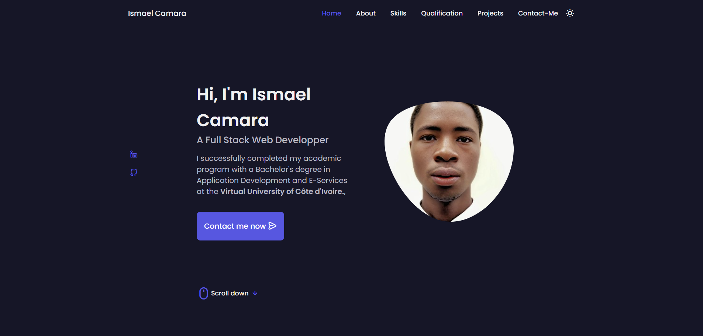

# Portfolio personnel — Ismael Camara

Site portfolio personnel de **Camara Ismael**, développeur full stack web (Abidjan, Côte d'Ivoire).

Le site est construit en **HTML, CSS et JavaScript vanilla** — sans framework ni étape de build — et se déploie en quelques secondes sur n'importe quel hébergeur statique.

## Aperçu



## Fonctionnalités

- **Accueil** : présentation rapide, liens LinkedIn et GitHub, appel à l'action.
- **À propos** : parcours, chiffres clés et téléchargement du CV.
- **Compétences** : accordéon de 4 catégories (langages, concepts informatiques, technologies, outils) avec barres de progression.
- **Parcours** : onglets *Formation* et *Distinctions* sous forme de timeline, avec modales « Voir plus ».
- **Projets** : carrousel (Swiper) présentant les réalisations, avec liens vers le dépôt et le site en ligne.
- **Contact** : coordonnées cliquables, bouton WhatsApp et formulaire fonctionnel via Formspree.
- **Thème clair / sombre** : bascule mémorisée dans le navigateur (`localStorage`).
- **Design responsive** : mobile, tablette et desktop, avec animations d'apparition au défilement.

## Technologies utilisées

- **HTML5** — structure sémantique et accessibilité.
- **CSS3** — design system en variables `:root`, Flexbox/Grid, thème clair et sombre.
- **JavaScript** — navigation, accordéon, onglets, modales, carrousel, formulaire.
- **Swiper** — carrousel de projets (fichiers locaux dans `assets/`).
- **Unicons** — icônes (CDN).
- **Google Fonts** — Poppins + Space Grotesk.

## Structure du projet

```
portfolio-camara-ismael/
├── index.html                  # Page unique (toutes les sections)
├── preview.png                 # Image d'aperçu
├── README.md
└── assets/
    ├── newcss.css              # Feuille de style principale
    ├── ptj.js                  # Script principal
    ├── swiper-bundle.min.css
    ├── swiper-bundle.min.js
    ├── Camara_Ismael_CV.pdf    # CV téléchargeable
    └── img/
        ├── Pro.jpg             # Photo de profil
        ├── project-*.jpg       # Captures des projets (Ivomy, AutoLink CI, IvoireCakes, …)
        └── favicon.svg         # Favicon
```

## Démarrage

1. Cloner le dépôt :
   ```bash
   git clone https://github.com/leCoderon/My-personal-portfolio.git
   ```
2. Ouvrir le dossier du projet dans votre éditeur de code.
3. Ouvrir `index.html` dans un navigateur — aucune installation ni compilation n'est nécessaire.

## Configuration du formulaire de contact

Le formulaire utilise [Formspree](https://formspree.io/) pour envoyer les messages sans backend :

1. Créer un compte gratuit sur Formspree et un nouveau formulaire.
2. Copier l'identifiant fourni (de la forme `https://formspree.io/f/xxxxxxx`).
3. Dans `index.html`, remplacer `VOTRE_ID` dans l'attribut `action` du formulaire `#contact-form`.

Tant que l'identifiant n'est pas renseigné, un message d'aide s'affiche à la soumission.

## Personnalisation

- **Couleur d'accent** : modifier `--hue-color` dans `:root` (`assets/newcss.css`).
- **Contenu** : éditer directement `index.html` (textes, projets, coordonnées).
- **Coordonnées** : le numéro de téléphone et le lien WhatsApp se trouvent dans les sections Contact et le pied de page.

## Déploiement

Le site étant entièrement statique, il peut être publié tel quel sur **GitHub Pages**, **Netlify** ou **Vercel**, sans étape de build. Une version en ligne est disponible ici : <https://lecoderon.github.io/My-personal-portfolio/>.

## Contact

- Email : <camara9ismael@gmail.com>
- Téléphone / WhatsApp : +225 05 84 78 45 81
- GitHub : <https://github.com/leCoderon>
- LinkedIn : <https://www.linkedin.com/in/isma%C3%ABl-camara-stage-developpeur-web-abidjan>

---

© Ismael Camara. Tous droits réservés.
